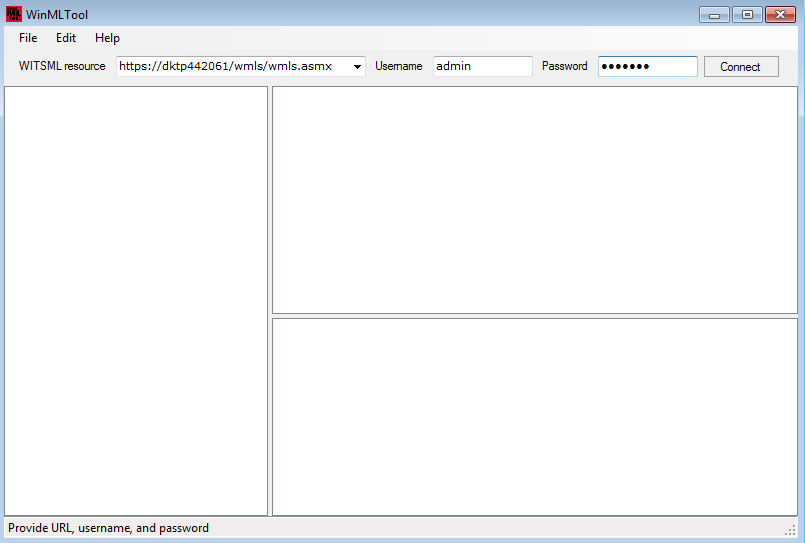

# winmltool
A Simple WITSML Client

WITSML is widely used nowadays for exchanging well drilling data between parties. As one of service companies who delivers WITSML service, we sometime have no idea if our customers are receiving the data in correct fashion; other than asking them how the data looks at their end. This is the reason behind the writing of this simple utility.

